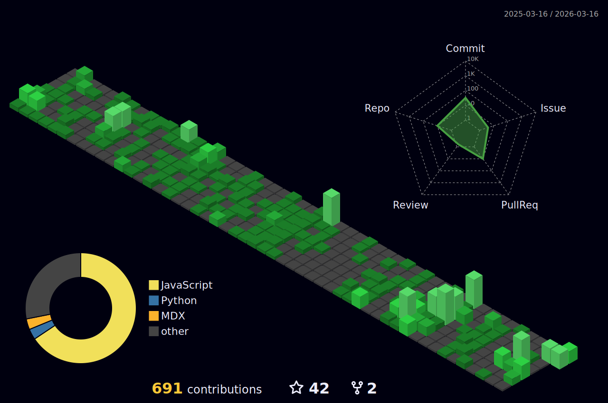

<div align="center">


<a href="https://git.io/typing-svg">
  
</a>

</div>

## `> whoami`

```yaml
name:       "Ark"
languages:  ["C++", "Rust", "TypeScript", "React", "Next.js"]
motto:      "扭转时间的公式：把握今天"
```

<div align="center">
  
</div>

## `> ls ~/tech-stack/`

<div align="center">

<p>
  
</p>

</div>

<div align="center">
  
</div>

## `> neofetch`

<div align="center">
  <picture>
    
  </picture>
  <picture>
    
  </picture>
</div>

<br>

<div align="center">
  
</div>

<div align="center">
  
</div>

## `> git log --graph`

<div align="center">
  <a href="https://github.com/ryo-ma/github-profile-trophy">
    
  </a>
</div>

<br>

<div align="center">
  <picture>
    <source media="(prefers-color-scheme: dark)" srcset="./profile-3d-contrib/profile-night-green.svg" />
    
  </picture>
</div>
